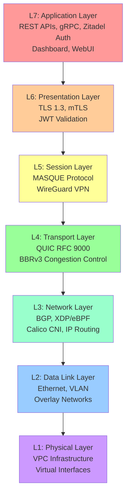
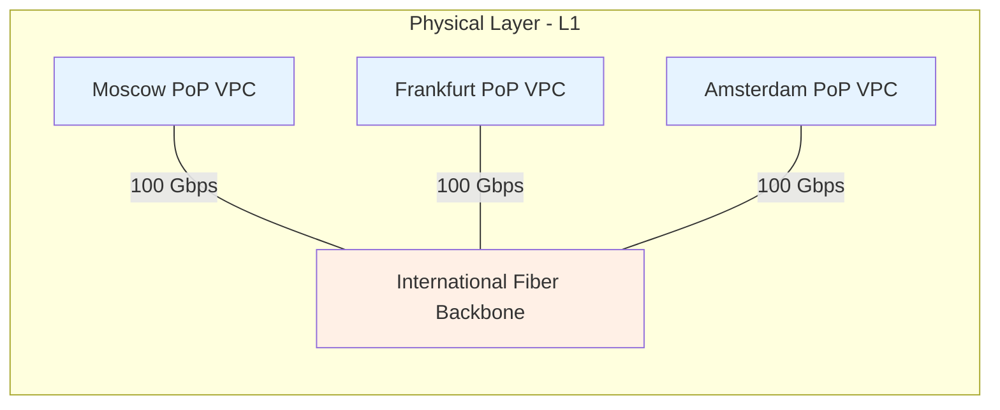
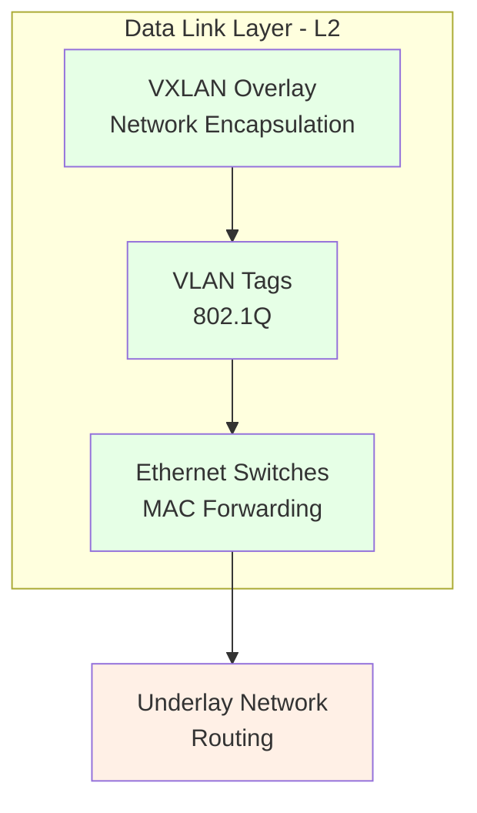
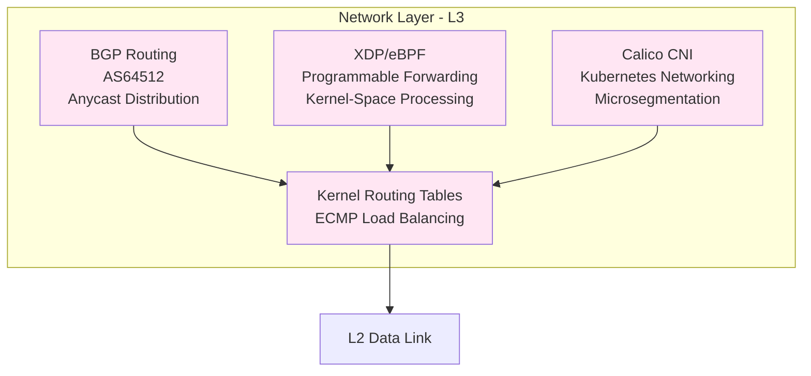
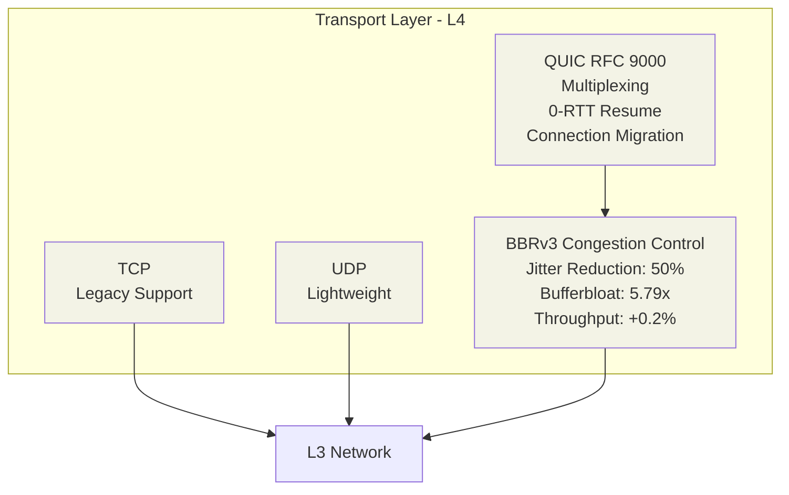
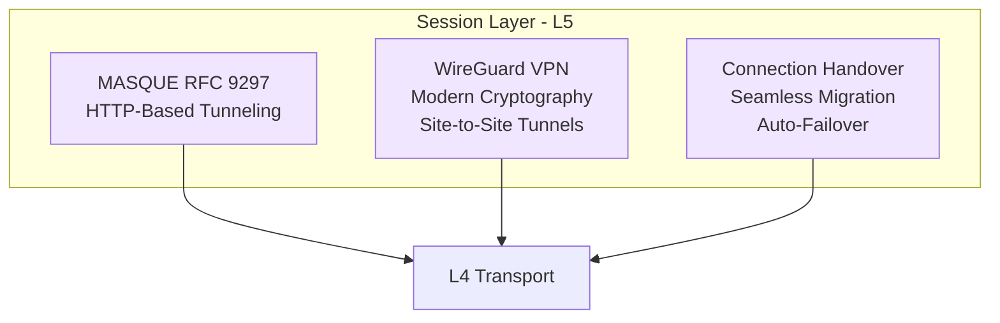
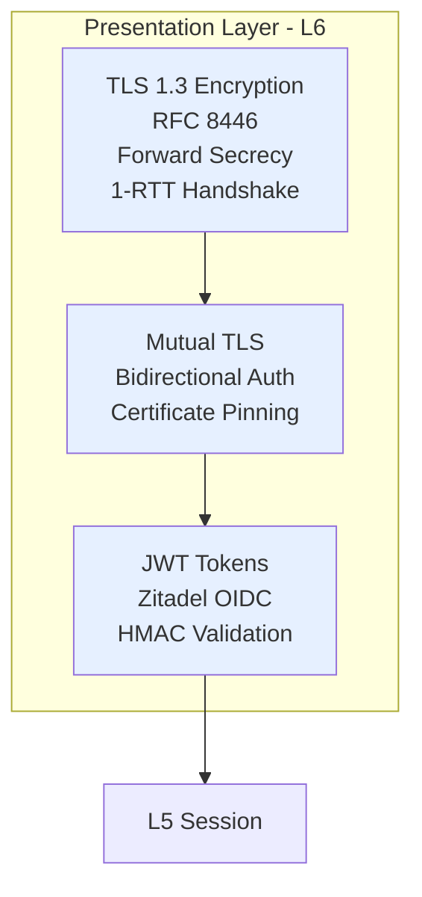
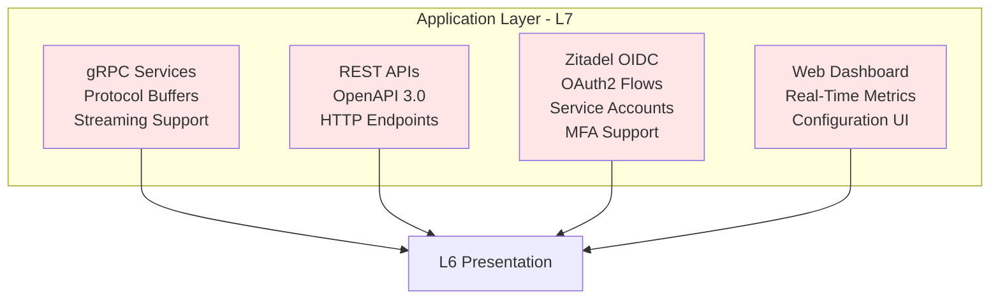
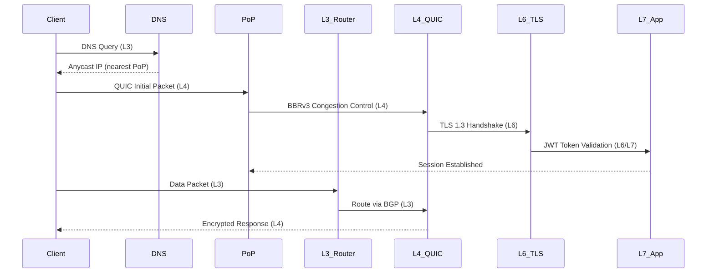
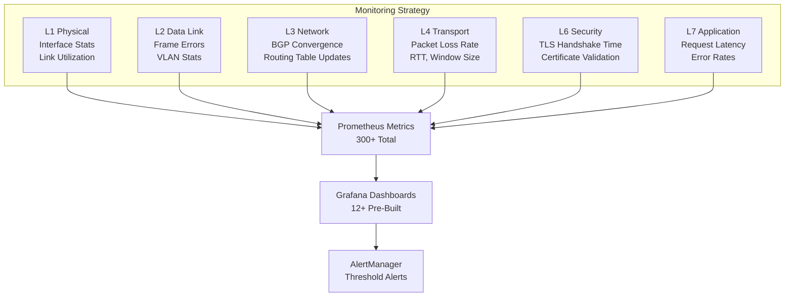

# CloudBridge Network Layers - OSI Model L1-L7

**Version:** 2.0  
**Updated:** November 3, 2025  
**Status:** Architecture Reference - Code-Free

## Overview

CloudBridge network architecture spans all seven OSI layers with optimized implementations at each level. The architecture delivers sub-millisecond latency, high throughput, and global anycast routing through multi-region Points of Presence (PoPs).

See **[Protocol Stack](PROTOCOL_STACK.md)** for detailed protocol specifications and **[Complete Architecture Guide](COMPLETE_ARCHITECTURE_GUIDE.md)** for full system architecture.

### Architecture Characteristics

- Multi-layer optimization across L1-L7 OSI model
- BBRv3 congestion control with 50% jitter reduction
- Zero-trust security with TLS 1.3 and mTLS
- Zitadel OIDC authentication integration
- BGP-based anycast routing with automatic failover
- Global PoPs with edge computing capabilities

---

## Layer Architecture Overview

---

## L1: Physical Layer

**Responsibility:** Physical network infrastructure and interface management.

### Components

- VPC Infrastructure: Virtual Private Cloud in AWS/Yandex Cloud
- Virtual Network Interfaces: Elastic Network Interfaces with multiple IP addresses
- Fiber Optics: International backbone connectivity
- Link Aggregation: Bonded interfaces for redundancy

### Architecture

### Key Features

- Multi-region PoP deployment
- Redundant connectivity between PoPs
- Sub-millisecond backbone optimization
- DDoS mitigation at physical layer

---

## L2: Data Link Layer

**Responsibility:** Frame forwarding, switching, and overlay network management.

### Components

- Ethernet Switching: L2 MAC address learning
- VLAN Tagging: 802.1Q network segmentation
- VXLAN/Geneve: Overlay network encapsulation
- MAC Address Management: Dynamic table management

### Architecture

### Key Features

- Per-tenant VLAN isolation
- Overlay networks for elastic scaling
- Broadcast/multicast optimization
- Loop prevention via STP/RSTP

---

## L3: Network Layer

**Responsibility:** IP routing, path optimization, and programmable forwarding.

### Components

**IP Routing:**
- Linux kernel routing tables with dynamic updates
- Equal-Cost Multi-Path (ECMP) load balancing
- Policy-based routing for traffic engineering

**BGP Anycast Routing:**
- Autonomous System AS64512
- Anycast address announcement from multiple PoPs
- Sub-second failover via BGP reconvergence
- Route policy enforcement

**XDP/eBPF:**
- Kernel-bypass packet processing
- Programmable packet filtering
- Custom load balancing decisions
- In-kernel L4 connection tracking

**Calico CNI:**
- Kubernetes pod-to-pod networking
- Network policies for microsegmentation
- BGP integration for external routes
- IP-in-IP or VXLAN encapsulation

### Architecture

### Key Features

- Anycast load distribution across PoPs
- Automatic failover when PoPs unavailable
- Traffic steering based on source/destination
- IPv4 and IPv6 dual-stack support

---

## L4: Transport Layer

**Responsibility:** End-to-end connection management and congestion control.

### Components

**QUIC Protocol (RFC 9000):**
- Connection multiplexing: Multiple streams per connection
- 0-RTT: Zero Round-Trip Time session resumption
- Connection migration: Seamless mobility
- Datagram support: For time-sensitive applications
- Built-in encryption at transport layer

**BBRv3 Congestion Control:**
- Utilization-based algorithm
- 50% jitter reduction (0.0018ms to 0.0009ms)
- 5.79x bufferbloat improvement
- Maintained throughput (+0.2%)
- Environment variable: CBR_CC=bbrv3

**Legacy Transport:**
- TCP: Backward compatibility
- UDP: Lightweight connectionless
- SCTP: Ordered multi-stream delivery

### Architecture

### Key Features

- Connection multiplexing reduces setup overhead
- 0-RTT enables instant resumption
- Connection migration supports seamless handover
- Datagram mode for ultra-low latency

---

## L5: Session Layer

**Responsibility:** Connection session management and tunneling.

### Components

**MASQUE (RFC 9297):**
- HTTP-based tunneling protocol
- Encapsulates traffic in HTTP requests/responses
- Seamless CDN integration
- Proxy-compatible tunneling

**WireGuard VPN:**
- Modern cryptographic VPN
- Site-to-site VPN tunnels
- Client-to-PoP VPN access
- Perfect Forward Secrecy (PFS)

**Connection Handover:**
- Seamless network transitions
- TLS early data (0-RTT) resumption
- Transparent PoP failover

### Architecture

### Key Features

- Tunneling protocols support direct/proxied connections
- VPN encryption with modern cryptography
- Automatic failover during transitions

---

## L6: Presentation Layer

**Responsibility:** Encryption, authentication, and data format negotiation.

### Components

**TLS 1.3 Encryption (RFC 8446):**
- Modern encryption standard
- Forward secrecy: Past secure even if keys compromised
- Single RTT connection establishment
- 0-RTT session resumption
- Cipher suites: TLS_AES_256_GCM_SHA384, TLS_CHACHA20_POLY1305_SHA256

**Mutual TLS (mTLS):**
- Bidirectional authentication
- Certificate pinning for critical paths
- Automatic certificate rotation via ACME
- X.509 validation with OCSP revocation checking

**JWT Token Management:**
- Zitadel-issued JWT tokens
- Token validation via HMAC signature
- Token claims: Subject, Audience, Expiration
- Automatic renewal before expiration

### Architecture

### Key Features

- Encryption protects against eavesdropping
- Mutual authentication prevents man-in-the-middle
- JWT tokens enable zero-trust architecture

---

## L7: Application Layer

**Responsibility:** Service APIs, user authentication, and business logic.

### Components

**gRPC Services:**
- High-performance RPC framework
- Protocol Buffers for serialization
- Streaming support: Unary, server, client, bidirectional
- Service mesh integration

**REST APIs:**
- RESTful HTTP endpoints
- OpenAPI 3.0 specification
- JSON payload encoding

**Zitadel Identity Provider:**
- OpenID Connect (OIDC) implementation
- OAuth2 authorization flows
- Service account authentication
- Personal Access Token (PAT) generation
- Multi-factor authentication (MFA)

**Web Dashboard:**
- Real-time metrics visualization
- Network topology diagram
- Traffic analytics and performance graphs
- Configuration management UI

### Architecture

### Key Features

- gRPC enables low-latency service communication
- Zitadel provides centralized auth and authorization
- REST APIs enable external tool integration
- Web UI provides operational visibility

---

## Complete Data Flow: Client to PoP

---

## Security Architecture

### Authentication and Authorization

- Zitadel OIDC: User authentication with MFA
- JWT Tokens: Service-to-service identification
- mTLS: Mutual authentication between PoPs
- Certificate Pinning: Critical path protection

### Encryption

- Transport: TLS 1.3 for all traffic
- Application: Additional encryption for sensitive data
- VPN: WireGuard for remote client encryption

### Network Segmentation

- VLANs (L2): Per-tenant isolation
- Network Policies (L3): Calico-based microsegmentation
- Firewall Rules (L3): Stateful filtering at PoP ingress

### DDoS Protection

See **[Complete Architecture Guide](COMPLETE_ARCHITECTURE_GUIDE.md)** for DDoS Protection component (Step 3) details.

- Physical Layer Filtering: Upstream ISP mitigation
- XDP/eBPF Filters (L3): Kernel-space rate limiting
- BGP Flowspec: Dynamic attack mitigation

---

## Performance Optimization

### BBRv3 Algorithm Benefits

- Jitter Reduction: 50% improvement
- Bufferbloat: 5.79x improvement
- Throughput: Maintained at +0.2%
- Fairness: Equitable bandwidth sharing

### Connection Optimization

- 0-RTT Resume: Instant resumption for returning clients
- Connection Multiplexing (QUIC): Multiple streams reduce overhead
- Keep-Alive: Periodic heartbeats maintain state
- Pipelining: Multiple requests without wait

### Caching Strategy

- DNS Caching: Reduced lookup latency
- Connection Pooling: Reuse TLS connections
- HTTP Caching: Standard header support
- Application Caching: Per-application data caching

---

## Monitoring by Layer

---

## Technology Stack Summary

| Layer | Technology | Version | Status | Performance |
|-------|-----------|---------|--------|-------------|
| L1 | VPC Infrastructure | AWS/Yandex | Deployed | Multi-region |
| L2 | VXLAN | RFC 7348 | Deployed | 1000+ Mbps |
| L3 | BGP | RFC 4271 | Deployed | Sub-second failover |
| L3 | XDP/eBPF | Kernel 5.10+ | Deployed | Ultra-low latency |
| L4 | QUIC | RFC 9000 | Deployed | 0-RTT enabled |
| L4 | BBRv3 | Latest | Deployed | 50% jitter reduction |
| L5 | MASQUE | RFC 9297 | Deployed | HTTP tunneling |
| L5 | WireGuard | 1.0 | Deployed | Modern crypto |
| L6 | TLS | 1.3 (RFC 8446) | Deployed | 1-RTT handshake |
| L7 | gRPC | 1.50+ | Deployed | High performance |
| L7 | Zitadel | November 2025 | Deployed | Full OIDC/OAuth2 |

---

## Related Documentation

- **[Protocol Stack](PROTOCOL_STACK.md)** - Complete protocol layer specifications and implementation details
- **[Complete Architecture Guide](COMPLETE_ARCHITECTURE_GUIDE.md)** - Full system architecture overview
- **[Project Overview](PROJECT_OVERVIEW.md)** - All 8 components with detailed descriptions
- **[Architecture Flow](ARCHITECTURE_FLOW.md)** - Request processing pipeline with layer details
- **[Tenant Isolation Architecture](TENANT_ISOLATION_ARCHITECTURE.md)** - Network isolation and multi-tenancy
- **[DNS Network Architecture](DNS_NETWORK_ARCHITECTURE.md)** - DNS design and anycast routing
- **[Client Architecture](CLIENT_ARCHITECTURE.md)** - How clients interact with network layers
- **[Requirements Matrix](REQUIREMENTS_MATRIX.md)** - Component requirements and capabilities
- **[Data Sources](DATA_SOURCES.md)** - Metric definitions and verification

---

**Document Status:** Current and Accurate  
**Last Verified:** November 5, 2025  
**Next Review:** Q4 2025 or new major features

