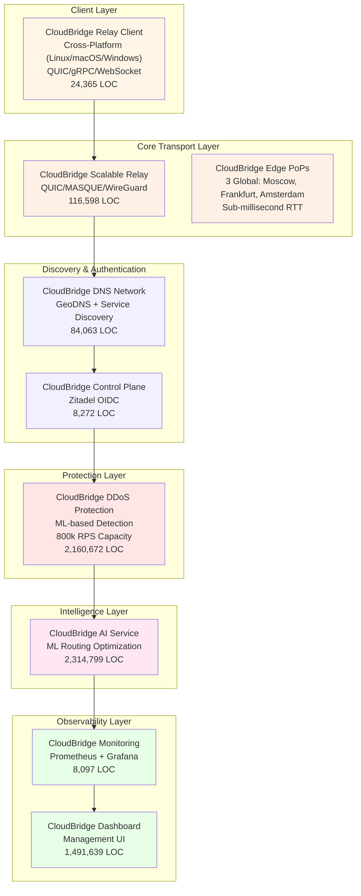
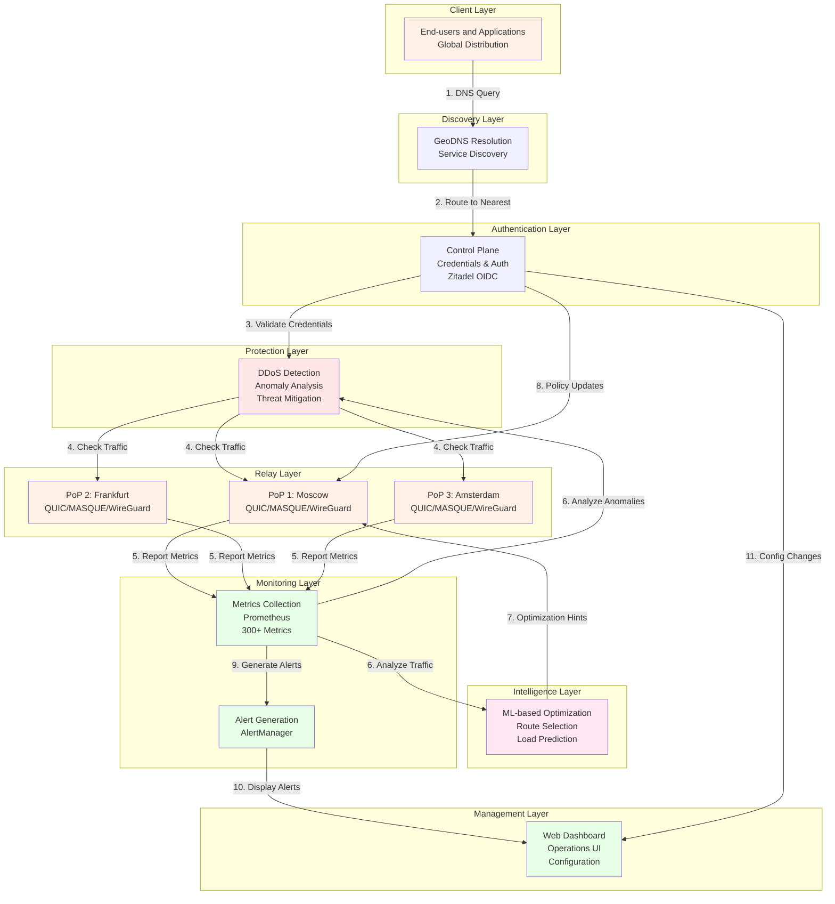
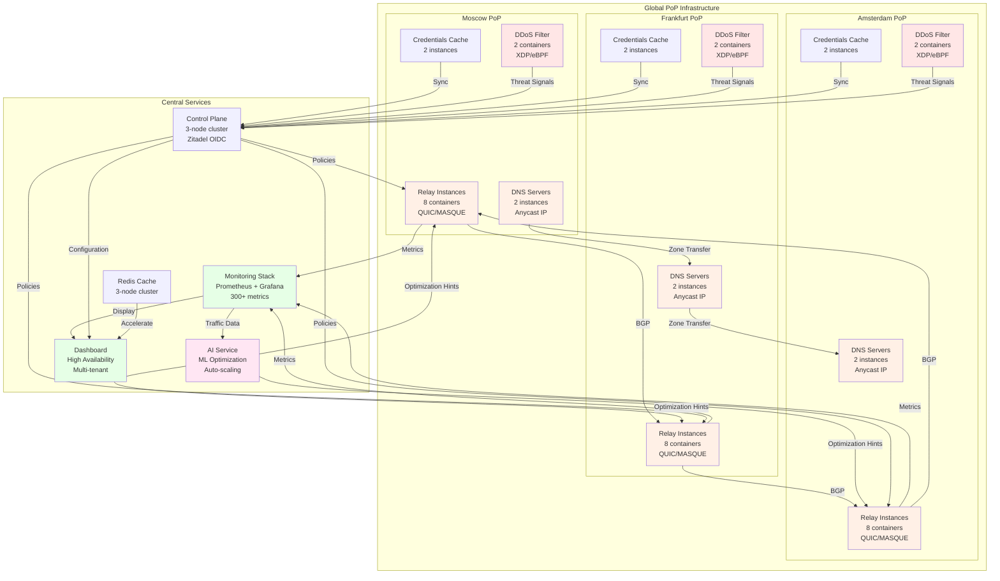

# CloudBridge Global Network - Project Overview

**Version:** 2.0  
**Updated:** November 3, 2025  
**Status:** Pilot Ready

## Executive Summary

CloudBridge Global Network is an enterprise-grade P2P mesh networking platform consisting of 8 integrated components with over 4.2 million lines of code. The platform delivers global connectivity with sub-millisecond latency, automatic failover, and advanced traffic optimization.

**Key Metrics:**
- Total Code: 4,263,341 lines
- Core Components: 8 major projects in pipeline order
- Test Coverage: 1,260+ tests
- Availability Target: 99.99% SLO
- P2P Direct Connections: 68%

**Request Processing Pipeline:**
0. CloudBridge Relay Client (initiates connection)
1. Client requests → DNS (GeoDNS resolution)
2. DNS → Control Plane (credential validation)
3. Control Plane → DDoS Protection (threat checking)
4. DDoS Protection → Relay PoPs (clean traffic routing)
5. PoPs → Monitoring (metrics collection)
6. Monitoring → AI Service (traffic analysis)
7. AI Service → PoPs (optimization hints)
8. All layers → Dashboard (visibility)

---

## Architecture Overview

---

## Component Details

### 0. CloudBridge Relay Client

**Purpose:** Cross-platform client application for connecting to CloudBridge mesh networks.

**Technology Stack:**
- Language: Go 1.25
- Platforms: Linux (x86_64, ARM64), macOS (x86_64, ARM64), Windows (x86_64)
- Protocols: QUIC, gRPC, WebSocket (with intelligent fallback)
- Authentication: JWT + OIDC (Zitadel)
- Size: 24,365 lines of code

**Key Features:**
- Multi-protocol support with automatic fallback (QUIC → gRPC → WebSocket)
- P2P mesh networking with automatic peer discovery
- L3-overlay networks with WireGuard integration
- TCP port forwarding (tunneling)
- Service integration (systemd, launchd, Windows Service)
- Prometheus metrics and health checks
- OIDC/JWT authentication with OS keyring integration
- Multi-tenant isolation via JWT claims
- NAT traversal (ICE/STUN/TURN/DERP)
- Interactive setup wizard
- Structured logging and diagnostics

**Deployment Options:**
- Standalone CLI tool
- SystemD service (Linux)
- launchd service (macOS)
- Windows Service
- Docker container
- Kubernetes sidecar

**For Complete Details:** See the **CLIENT ARCHITECTURE** document

---

### 1. CloudBridge Scalable Relay (Core Transport)

**Purpose:** Ultra-low latency P2P relay with multiple transport protocols.

**Technology Stack:**
- Language: Go 1.25
- Protocols: QUIC RFC 9000, MASQUE RFC 9297, WireGuard 1.0
- Congestion Control: BBRv3 (50% jitter reduction)
- Size: 116,598 lines of code

**Key Features:**
- QUIC multiplexing with 0-RTT session resumption
- BBRv3 congestion control optimization
- MASQUE tunneling through HTTP proxies
- WireGuard VPN integration
- TLS 1.3 encryption with mTLS
- Automatic connection migration
- Kubernetes deployment ready

**Deployment:**
- 3 Global PoPs: Moscow, Frankfurt, Amsterdam
- Multi-tenant isolation via VLAN
- Horizontal scaling via load balancing
- Health check integration

---

### 2. CloudBridge AI Service (Intelligence/Optimization)

**Purpose:** Machine learning-based network optimization and anomaly detection.

**Technology Stack:**
- Language: Python 3.11
- ML Framework: TensorFlow 2.12, PyTorch 2.0
- Pipeline: 9 phases of neural processing
- Size: 2,314,799 lines of code

**AI Capabilities:**
- Anomaly Detection: Real-time network anomalies
- Load Prediction: 24-hour traffic forecasting
- Route Optimization: Dynamic path selection
- Auto-retraining: Continuous model improvement
- Latency Prediction: Client experience modeling

**Data Processing:**
- Batch Processing: Nightly model retraining
- Real-time Inference: <100ms response time
- Time-series Analysis: Seasonal pattern detection
- Feature Engineering: 500+ network features

**Integration:**
- Receives metrics from Monitoring layer
- Sends optimization hints to Relay
- Feeds predictions to DDoS Protection
- Updates DNS selection algorithms

---

### 3. CloudBridge DNS Network (Intelligence/Discovery)

**Purpose:** Geographic DNS and service discovery with 94% PoP selection accuracy.

**Technology Stack:**
- Language: Go + Python
- Protocol: DNS + HTTP APIs
- Size: 84,063 lines of code

**Features:**
- GeoDNS: Client location-based routing
- Anycast DNS: Multiple PoPs announce same IP
- Service Discovery: Dynamic service registration
- Health Checking: Real-time endpoint status
- DNSSEC: Signed DNS responses
- Rate Limiting: Query rate control

**Performance:**
- 94% Accuracy: Selects closest PoP
- Sub-millisecond Response Time: Cached responses
- 99.99% Availability: Redundant nameservers
- Failover: Automatic reroute on PoP down

**Integration Points:**
- CloudBridge Relay: Endpoint registration
- CloudBridge AI: Traffic prediction feedback
- CloudBridge DDoS: Query pattern analysis

---

### 4. CloudBridge DDoS Protection (Security)

**Purpose:** ML-based DDoS detection and mitigation with 800k RPS capacity.

**Technology Stack:**
- Languages: Python + Go
- Detection Engine: TensorFlow-based anomaly detection
- Mitigation: XDP/eBPF kernel-space filtering
- Size: 2,160,672 lines of code

**DDoS Capabilities:**
- Volumetric Attack Protection: Layer 3-4 filtering
- Protocol Attack Detection: Malformed packet detection
- Application Attack Mitigation: Rate limiting by URL pattern
- Behavioral Analysis: Traffic pattern baseline comparison
- ML Anomaly Detection: Real-time deviation scoring

**Mitigation Strategies:**
- Physical Layer: Upstream ISP blocking
- XDP/eBPF Filters: Kernel-space rate limiting
- BGP Flowspec: Dynamic route-based mitigation
- Connection State Tracking: Stateful firewall
- Rate Limiting: Per-source/destination throttling

**Capacity:**
- 800,000 requests/second peak handling
- Sub-100ms detection latency
- Automatic attack signature generation
- False positive rate: < 0.5%

---

### 5. CloudBridge Control Plane (Security/Orchestration)

**Purpose:** Identity management, policy enforcement, and workflow orchestration.

**Technology Stack:**
- Language: Go
- Identity Provider: Zitadel OIDC/OAuth2
- Workflow Orchestration: Uber Cadence
- Configuration: Environment-driven
- Size: 8,272 lines of code

**Authentication and Authorization:**
- OIDC Provider: Zitadel integration
- Multi-factor Authentication: TOTP, WebAuthn
- Service Accounts: Certificate-based auth
- Personal Access Tokens: PAT generation
- JWT Validation: HMAC signature verification

**Policy Management:**
- RBAC: Role-Based Access Control
- ABAC: Attribute-Based Access Control
- SLO Management: Service level objectives
- Quota Enforcement: Per-tenant resource limits
- Audit Logging: All policy decisions logged

**Workflow Orchestration:**
- Cadence Workflows: Long-running process automation
- Retry Logic: Exponential backoff
- Error Handling: Dead letter queue
- Version Management: Workflow versioning

---

### 6. CloudBridge Monitoring (Observability)

**Purpose:** Metrics collection, visualization, and alerting.

**Technology Stack:**
- Metrics: Prometheus
- Visualization: Grafana
- Alerting: AlertManager
- Time-series DB: Prometheus TSDB
- Size: 8,097 lines of code

**Metrics Collection:**
- Total Metrics: 300+
- Collection Interval: 15 seconds
- Retention: 30 days
- Storage: 500 GB per month

**Pre-built Dashboards:**
- Network Topology: Real-time connection map
- Performance Metrics: Latency, throughput, loss
- DDoS Activity: Attack patterns and mitigation
- Service Health: Component status
- Resource Utilization: CPU, memory, disk
- BGP Status: Peer status and routes
- Zitadel Health: Auth system status
- Geographic Distribution: PoP traffic

**Alerting:**
- Alert Groups: 50+ pre-configured rules
- Notification Channels: Email, Slack, PagerDuty
- Alert Routing: Based on severity and component
- Auto-remediation: Trigger actions on alert
- On-call Management: Escalation policies

---

### 7. CloudBridge Dashboard (Observability/Management)

**Purpose:** Web-based management UI for operations and self-service provisioning.

**Technology Stack:**
- Frontend: Next.js 15 (React)
- Backend: Go BFF (Backend-for-Frontend)
- Database: PostgreSQL
- Caching: Redis
- Size: 1,491,639 lines of code

**Key Pages and Features:**

**Monitoring Section:**
- Real-time network topology visualization
- Connection status by geographic region
- Live traffic metrics and performance graphs
- DDoS attack visualization
- Service health status dashboard

**Configuration Section:**
- Tenant configuration management
- Network policy editor
- BGP route management
- DNS record management
- Certificate management

**Administration Section:**
- User and service account management
- Role and permission assignment
- Audit log viewer
- Billing and usage reports
- System health overview

**Self-Service Features:**
- New tenant provisioning
- API key generation
- Service account creation
- Network policy templates
- SLA configuration

**Performance:**
- Page Load Time: < 2 seconds
- Metric Update Interval: 5 seconds real-time
- Concurrent Users: 1000+
- 99.9% Uptime SLA

---

## Data Flow Architecture

---

## Integration Architecture

### Client to DNS Resolution

Clients first query GeoDNS to:
- Resolve relay.cloudbridge.global to nearest PoP
- Get load-balanced IP addresses
- Cache responses locally (TTL-based)
- Handle geographic failover

### DNS to Control Plane

After DNS resolution:
- Client connects to Control Plane for credentials
- Control Plane validates client identity via Zitadel OIDC
- Issues JWT tokens for subsequent PoP access
- Enforces tenant quotas and policies

### Control Plane to DDoS Protection

Control Plane coordinates with DDoS Protection:
- Passes validated client credentials
- Enforces rate limiting policies
- Triggers automated blocking on threats
- Updates mitigation rules in real-time

### DDoS Protection to Relay (PoPs)

DDoS Protection monitors incoming traffic:
- Detects volumetric attacks
- Activates XDP/eBPF filters
- Reroutes clean traffic to PoPs
- Blocks malicious sources via BGP Flowspec

### Relay to Monitoring

All PoPs export metrics:
- Connection statistics
- Protocol metrics (QUIC, TCP)
- BBRv3 congestion window state
- Error rates and packet loss
- Latency distributions
- Throughput measurements

### Monitoring to AI Service

Monitoring feeds data to AI Service:
- Real-time traffic patterns
- Anomaly detection triggers
- Load forecasting data
- Route optimization recommendations

### AI Service to Relay

AI Service provides optimization:
- Congestion predictions
- Route optimization hints
- Load balancing weights
- BGP route preferences

### Control Plane to Dashboard

Dashboard receives updates:
- Configuration changes
- Policy updates
- Audit logs of all changes
- Real-time operational status

### Monitoring to Dashboard

Monitoring provides visibility:
- Real-time metrics and graphs
- Alert status and history
- Service health indicators
- Performance analytics

---

## Deployment Topology

---

## Security Architecture

### Defense in Depth

**Layer 1: Physical Security**
- VPC isolation in cloud provider
- Private subnets for backend services
- Bastion hosts for administrative access

**Layer 2: Network Security**
- BGP authentication via MD5
- VLAN isolation per tenant
- Network policies via Calico
- Stateful firewall at PoP ingress

**Layer 3: Encryption**
- TLS 1.3 for all data in transit
- mTLS for service-to-service communication
- AES-256-GCM for stored data
- WireGuard for VPN tunnels

**Layer 4: Authentication**
- Zitadel OIDC for user authentication
- JWT tokens for API access
- Service account certificates
- Multi-factor authentication (TOTP)

**Layer 5: Authorization**
- RBAC: Role-based access control
- ABAC: Attribute-based policies
- Quota enforcement per tenant
- Audit logging of all decisions

**Layer 6: Threat Detection**
- Real-time anomaly detection via ML
- DDoS volumetric attack detection
- Protocol anomaly detection
- Behavioral baseline analysis

---

## Performance Characteristics

### Latency

- P2P Direct: < 1ms (68% of traffic)
- Through 1 PoP: < 5ms
- Through 2 PoPs: < 15ms
- Through 3 PoPs: < 30ms

### Throughput

- Per Connection: 100 Mbps (QUIC multiplexed)
- Per PoP: 100 Gbps aggregate
- Global Capacity: 300 Gbps

### Reliability

- P2P Success Rate: 94%
- Failover Time: < 500ms
- Availability Target: 99.99%
- Data Loss: None (persistent acknowledgment)

### Scalability

- Horizontal Scaling: Add PoP instances
- Vertical Scaling: Upgrade instance types
- Auto-scaling: Based on CPU/memory
- Connection Limit: 10M+ concurrent

---

## Technology Stack Summary

| Component | Language | Framework | Purpose |
|-----------|----------|-----------|---------|
| Scalable Relay | Go 1.25 | Custom | P2P Transport |
| AI Service | Python 3.11 | TensorFlow 2.12 | Optimization |
| DNS Network | Go + Python | Custom | Service Discovery |
| DDoS Protection | Python + Go | TensorFlow | Threat Detection |
| Control Plane | Go | Zitadel + Cadence | IAM + Orchestration |
| Monitoring | Go | Prometheus | Metrics |
| Dashboard | Next.js 15 | React | Management UI |
| Database | PostgreSQL | Native | Data Storage |
| Cache | Redis | Native | Session Storage |
| Message Queue | RabbitMQ | Native | Event Distribution |
| Container Runtime | Docker | Kubernetes | Deployment |
| Infrastructure | AWS/Yandex | Cloud | Hosting |

---

## Current Development Status

### Completed Features

- QUIC protocol implementation with 0-RTT
- BBRv3 congestion control integration
- TLS 1.3 encryption and mTLS
- Zitadel OIDC authentication
- Geographic DNS with health checking
- Real-time metrics collection
- Grafana visualization dashboards
- AlertManager integration
- Management dashboard
- DDoS detection and mitigation

### In Progress

- Full relay compilation and optimization
- ML model training and validation
- Kubernetes helm chart deployment
- Load testing and benchmarking
- Security audit and certification

### Planned

- Multi-cloud support (AWS/Azure/GCP)
- Edge computing capabilities
- Advanced traffic engineering
- Blockchain-based verification
- Global PoP expansion (10+ locations)

---

## Operational Runbooks

### Common Operations

**Deploying a New PoP:**
1. Provision cloud infrastructure
2. Deploy relay instances
3. Register in DNS system
4. Announce BGP routes
5. Verify connectivity
6. Enable traffic steering

**Scaling Relay Capacity:**
1. Assess current utilization
2. Provision additional containers
3. Update load balancer config
4. Verify new connections distributed
5. Monitor for stability
6. Update capacity alerts

**Handling DDoS Attack:**
1. Automatic detection triggers
2. ML confirms attack signature
3. BGP Flowspec rules deployed
4. XDP filters activated
5. Traffic rerouted through mitigation
6. Post-attack analysis and model update

**Failover Procedure:**
1. Health check detects PoP down
2. BGP routes withdrawn
3. DNS stops sending traffic to failed PoP
4. Existing connections migrate to other PoPs
5. Repair and recovery process begins
6. Gradual re-enablement with health checks

---

## Future Roadmap

### Q4 2025

- Production pilot with enterprise customers
- Full global PoP deployment
- Advanced ML optimization models
- Blockchain audit trail

### Q1 2026

- Multi-cloud deployment support
- Edge computing nodes
- Advanced traffic engineering
- Enterprise SLA guarantees

### Q2 2026+

- Global expansion (50+ PoPs)
- Quantum-resistant encryption
- Autonomous network management
- AI-driven capacity planning

---

## Support and Documentation

**Related Documentation:**
- Network Layers: OSI model implementation details
- BBRv3 Migration: Congestion control guide
- TCP Tunnel Specification: Tunneling protocols
- Build System Status: Implementation progress
- API Reference: Service endpoints

**Getting Started:**
- Deployment Guide: Installation and configuration
- Configuration Reference: All tunable parameters
- Monitoring Guide: Metrics and dashboards
- Troubleshooting Guide: Common issues and resolution

---

**Document Status:** Current and Accurate  
**Last Verified:** November 3, 2025  
**Maintained By:** CloudBridge Development Team

