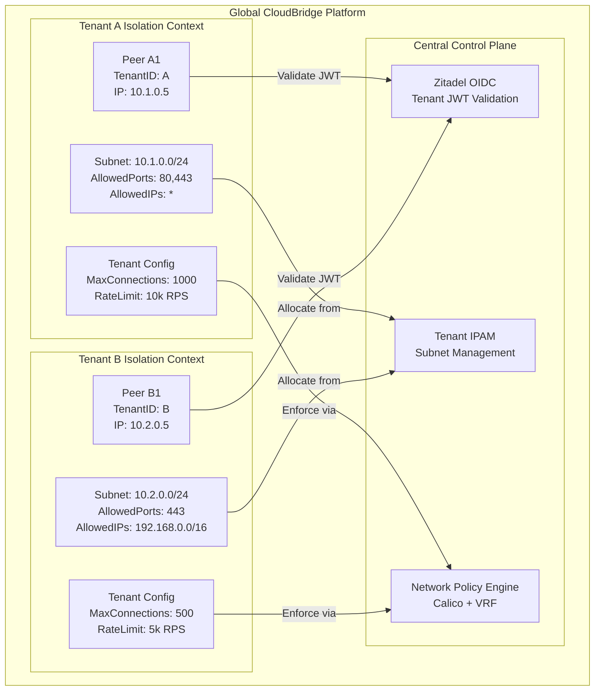
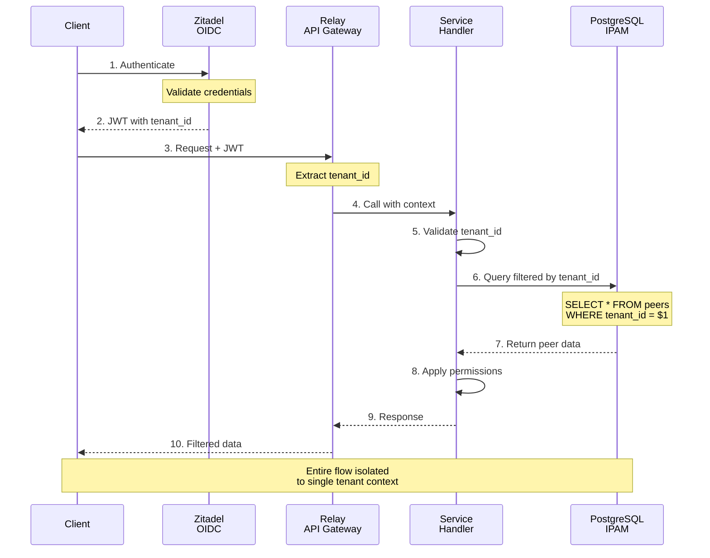

# Multi-Tenant Architecture and Isolation Model

**Version:** 2.0\
**Updated:** November 4, 2025\
**Status:** Complete Architecture Reference

***

## Executive Summary

CloudBridge implements enterprise-grade multi-tenancy with five distinct isolation layers ensuring zero cross-tenant access. Each tenant operates in a logically isolated environment with independent IP subnets, network policies, resource quotas, and peer networks.

**Isolation Guarantee:** ZERO cross-tenant access across network, application, resource, and data layers.

See [**Complete Architecture Guide**](COMPLETE_ARCHITECTURE_GUIDE.md) for the full system architecture and [**Architecture Flow**](ARCHITECTURE_FLOW.md) for the 8-step request processing pipeline.

***

## Multi-Tenancy Architecture Overview



***

## Five Isolation Layers

### Layer 1: Network Isolation

**Kubernetes NetworkPolicies:**

```yaml
Kind: NetworkPolicy
Name: tenant-isolation-ingress
Labels:
  tenant.cloudbridge.io/id: tenant-a
Spec:
  PodSelector:
    matchLabels:
      tenant.cloudbridge.io/id: tenant-a
  Ingress:
    - from:
      - podSelector:
          matchLabels:
            tenant.cloudbridge.io/id: tenant-a
    - from:
      - namespaceSelector:
          matchLabels:
            name: cloudbridge-control
    - ports:
      - protocol: UDP
        port: 53  # DNS only
  Egress:
    - to:
      - podSelector:
          matchLabels:
            tenant.cloudbridge.io/id: tenant-a
    - to:
      - namespaceSelector:
          matchLabels:
            name: cloudbridge-control
    - ports:
      - protocol: UDP
        port: 53  # DNS
```

**Calico GlobalNetworkPolicy (VRF):**

```
Tenant A:
├─ VRF ID: 1001
├─ Subnet: 10.1.0.0/24
├─ Route Table: Isolated to VRF 1001
└─ MTU: 1500

Tenant B:
├─ VRF ID: 1002
├─ Subnet: 10.2.0.0/24
├─ Route Table: Isolated to VRF 1002
└─ MTU: 1500

Isolation Mechanism:
- Packets from Tenant A cannot reach Tenant B's VRF
- Cross-tenant routes rejected at kernel level
- BGP route separation per VRF
```

**Inheritance Model:**

* Default-deny on all pods
* Whitelist allowed sources/destinations
* DNS access inherited to all tenants (global exception)
* Tenant-specific exceptions override defaults

***

### Layer 2: Application-Level Isolation

**Zitadel OIDC Authentication:**

```
Request Flow:
1. Client sends credentials to Control Plane
2. Zitadel validates and issues JWT token
3. JWT contains claim: "tenant_id": "tenant-a"
4. Client sends JWT with every request
5. Relay validates JWT signature (HMAC-SHA256)
6. Relay extracts tenant_id from JWT claims
7. Relay validates request matches token tenant
```

**JWT Token Structure:**

```json
{
  "sub": "peer-a1@tenant-a",
  "tenant_id": "tenant-a",
  "tenant_org": "Acme Corp",
  "exp": 1699107600,
  "iat": 1699021200,
  "aud": ["cloudbridge"],
  "scope": "openid profile email",
  "roles": ["relay-user"],
  "permissions": {
    "max_connections": 1000,
    "max_bandwidth": "10Gbps",
    "allowed_regions": ["eu-ams", "eu-fra"]
  }
}
```

**Token Validation (Every Request):**

```
Input: JWT token from client
Process:
  1. Verify signature using Zitadel public key
  2. Check expiration (now < exp)
  3. Extract tenant_id claim
  4. Verify tenant is enabled/not suspended
  5. Extract permissions from token
  6. Store in request context
Output: Validated tenant context or 401 Unauthorized
```

**Inheritance Model:**

* Tenant ID flows from Zitadel through all components
* Permissions inherited by all services
* Roles inherited and cascaded
* All API calls must include valid token
* Service-to-service mTLS carries tenant context

***

### Layer 3: Resource Isolation

**Kubernetes ResourceQuotas (Per-Tenant Namespace):**

```yaml
Kind: ResourceQuota
Name: tenant-a-quota
Namespace: cloudbridge-tenant-a
Spec:
  hard:
    requests.cpu: "100m"        # Max 100 millicores
    requests.memory: "256Mi"    # Max 256 MB
    limits.cpu: "500m"          # Max 500 millicores burst
    limits.memory: "1Gi"        # Max 1 GB burst
    pods: "50"                  # Max 50 pods
    services: "10"              # Max 10 services
    persistentvolumeclaims: "5" # Max 5 PVCs
  scopeSelector:
    matchExpressions:
    - operator: In
      scopeName: PriorityClass
      values: ["tenant-a"]
```

**Rate Limiting (Per-Tenant Control Plane):**

```
Tenant A Configuration:
├─ Max Concurrent Connections: 1000
├─ Max RPS (requests per second): 10,000
├─ Burst Capacity: 15,000 (1.5x baseline)
├─ Token Bucket:
│  ├─ Refill Rate: 10,000 tokens/sec
│  ├─ Max Tokens: 15,000
│  └─ Cost per request: 1 token
├─ Circuit Breaker:
│  ├─ Failure Threshold: 50 failures / 10sec
│  ├─ Timeout: 30 seconds
│  └─ Half-open retries: 3
└─ Memory Limit: 256 MB per PoP

Tenant B Configuration:
├─ Max Concurrent Connections: 500
├─ Max RPS (requests per second): 5,000
├─ Burst Capacity: 7,500 (1.5x baseline)
├─ Token Bucket:
│  ├─ Refill Rate: 5,000 tokens/sec
│  ├─ Max Tokens: 7,500
│  └─ Cost per request: 1 token
├─ Circuit Breaker:
│  ├─ Failure Threshold: 25 failures / 10sec
│  ├─ Timeout: 30 seconds
│  └─ Half-open retries: 3
└─ Memory Limit: 128 MB per PoP
```

**Inheritance Model:**

* Per-tenant quota applies to namespace
* All pods in namespace share quota
* Exceeding quota blocks new pod creation
* Rate limits inherited by all services
* Burst capacity auto-cascades to child services

***

### Layer 4: Data Isolation

**IPAM (IP Address Management):**

```
Tenant IPAM Configuration:
├─ Base CIDR: 10.0.0.0/8
├─ Per-Tenant Subnet: /24 (252 usable IPs)
├─ Allocation Algorithm:
│  ├─ Deterministic: SHA256(tenantID + salt + attempt)
│  ├─ Collision Detection: Database query before use
│  ├─ Retry Count: 1000 attempts max
│  └─ Timeout: 60 seconds
├─ Storage: PostgreSQL (SERIALIZABLE isolation)
└─ Persistence: JSON file-based backup

Example Allocation:
Tenant A:
  ├─ SHA256(tenant-a + salt + 0) = ...abc
  ├─ Subnet Generated: 10.1.0.0/24
  ├─ Gateway: 10.1.0.1 (reserved)
  ├─ Usable Range: 10.1.0.2 - 10.1.0.254
  └─ Broadcast: 10.1.0.255 (reserved)

Tenant B:
  ├─ SHA256(tenant-b + salt + 0) = ...def
  ├─ Subnet Generated: 10.2.0.0/24
  ├─ Gateway: 10.2.0.1 (reserved)
  ├─ Usable Range: 10.2.0.2 - 10.2.0.254
  └─ Broadcast: 10.2.0.255 (reserved)
```

**Per-Peer IP Allocation:**

```
Peer Connection Lifecycle:

1. PEER_CONNECT (First Connection)
   Input: PeerID, TenantID
   Process:
     - Lock tenant subnet (SERIALIZABLE)
     - Query available IPs
     - Check collision
     - Allocate next free IP
     - Store allocation with timestamp
     - Unlock tenant subnet
   Output: 10.1.0.5 assigned to peer-a1

2. PEER_RECONNECT (Reconnection)
   Input: PeerID, TenantID
   Process:
     - Query previous IP for PeerID
     - If found and still available: reuse
     - If found but taken: allocate new
     - If not found: allocate new
   Output: Same IP if available, else new IP

3. PEER_DISCONNECT (Graceful Disconnect)
   Input: PeerID, TenantID
   Process:
     - Mark IP as available
     - Log disconnection
     - Start cleanup timer (24 hours)
     - Preserve mapping for reconnect
   Output: IP returned to pool after grace period

4. PEER_TIMEOUT (Connection Timeout)
   Input: PeerID, TenantID
   Process:
     - Detect no activity for 30 minutes
     - Mark as timed-out
     - Keep IP reserved for 1 hour
     - Auto-cleanup if no reconnect
   Output: IP released or reassigned
```

**Database Schema:**

```
TABLE tenants (
  tenant_id TEXT PRIMARY KEY,
  tenant_name TEXT,
  organization TEXT,
  status ENUM (active, suspended, deleted),
  max_connections INT,
  max_rps INT,
  allowed_ips CIDR[],
  allowed_ports INT[],
  created_at TIMESTAMP,
  updated_at TIMESTAMP
)

TABLE tenant_subnets (
  tenant_id TEXT FOREIGN KEY,
  subnet CIDR UNIQUE,
  vrf_id INT UNIQUE,
  gateway_ip INET,
  broadcast_ip INET,
  created_at TIMESTAMP,
  CONSTRAINT unique_per_tenant UNIQUE (tenant_id)
)

TABLE tenant_ip_allocations (
  tenant_id TEXT FOREIGN KEY,
  allocated_ip INET,
  available BOOLEAN,
  allocated_at TIMESTAMP,
  released_at TIMESTAMP NULL,
  CONSTRAINT unique_per_subnet UNIQUE (tenant_id, allocated_ip)
)

TABLE peer_ip_allocations (
  peer_id TEXT,
  tenant_id TEXT FOREIGN KEY,
  allocated_ip INET FOREIGN KEY,
  device_id TEXT,
  connection_type ENUM (relay, direct, tunnel),
  last_seen TIMESTAMP,
  created_at TIMESTAMP,
  CONSTRAINT unique_per_tenant_peer UNIQUE (tenant_id, peer_id),
  CONSTRAINT unique_per_peer UNIQUE (peer_id)
)

TABLE ip_usage_tracking (
  tenant_id TEXT FOREIGN KEY,
  available_count INT,
  allocated_count INT,
  reserved_count INT,
  updated_at TIMESTAMP,
  CONSTRAINT one_per_tenant UNIQUE (tenant_id)
)
```

**Transaction Isolation:**

```
SERIALIZABLE Isolation Level:
- All tenant IPAM operations use SERIALIZABLE
- Prevents race conditions on IP allocation
- Guarantees atomicity of allocation
- Cost: Slight performance hit, worth it for correctness

Example Race Condition Prevention:

Without SERIALIZABLE:
  Thread A: Query available IPs → 10.1.0.5 available
  Thread B: Query available IPs → 10.1.0.5 available
  Thread A: Allocate 10.1.0.5 ✓
  Thread B: Allocate 10.1.0.5 ✓ DUPLICATE! ✗

With SERIALIZABLE:
  Thread A: Lock tenant subnet + query
  Thread B: Wait for lock
  Thread A: Allocate 10.1.0.5 ✓
  Thread B: Get lock + query → 10.1.0.5 taken
  Thread B: Allocate 10.1.0.6 ✓
```

**Inheritance Model:**

* Subnet inherited by all peers of tenant
* IP allocation inherits tenant restrictions
* Permissions inherited from tenant config
* Cleanup rules inherited by all peers
* Database filters applied at query layer

***

### Layer 5: Operational Isolation

**Audit Logging (90-Day Retention):**

```
Log Entry Structure:
{
  "timestamp": "2025-11-04T15:30:45Z",
  "tenant_id": "tenant-a",
  "audit_type": "peer_connect",
  "peer_id": "peer-a1",
  "source_ip": "203.0.113.1",
  "action": "PEER_CONNECT",
  "resource": "peer:peer-a1",
  "status": "SUCCESS",
  "allocated_ip": "10.1.0.5",
  "details": {
    "device_id": "device-001",
    "connection_type": "relay",
    "session_id": "sess-abc123",
    "ttl": 3600
  },
  "user_agent": "CloudBridge-Client/2.0",
  "trace_id": "trace-xyz789"
}

Retention Policy:
├─ ERROR level: 90 days
├─ WARNING level: 60 days
├─ INFO level: 30 days
├─ DEBUG level: 7 days
└─ Storage: CloudBridge Monitoring (Prometheus/Grafana)

Audit Log Analysis:
1. Tenant A activity isolated
2. Tenant B activity isolated
3. Cross-tenant access attempts logged (should be 0)
4. Violations trigger immediate alerts
```

**Metrics Isolation:**

```
Prometheus Metric Labels:
{
  "metric": "quic_connections_total",
  "labels": {
    "tenant_id": "tenant-a",
    "pop": "eu-ams",
    "connection_type": "relay"
  },
  "value": 245,
  "timestamp": "2025-11-04T15:30:45Z"
}

Metric Cardinality Protection:
├─ Max labels per metric: 10
├─ Max unique label values: 1000 per label
├─ Cardinality limit: 100,000 per tenant
├─ Scrape timeout: 5 seconds
└─ Failure mode: Skip tenant metrics if exceeded

Grafana Dashboard Isolation:
├─ Dashboard per tenant (RBAC enforced)
├─ Default filter: tenant_id = current_tenant
├─ Cross-tenant view: Requires admin role
├─ Export restricted: Only own tenant data
└─ Alert notifications: Tenant-specific channels
```

**Isolation Enforcement Points:**

```
1. API Gateway (Relay)
   ├─ Validate JWT token
   ├─ Extract tenant_id
   ├─ Add to request context
   └─ Block if missing/invalid

2. Service Handler (All services)
   ├─ Read tenant_id from context
   ├─ Validate against resource
   ├─ Filter all queries by tenant
   └─ Return 403 if mismatch

3. Database Layer (PostgreSQL)
   ├─ All queries filtered by tenant_id
   ├─ Row-level security policies (RLS)
   ├─ SERIALIZABLE transactions for critical ops
   └─ Audit trigger on all mutations

4. Message Queue (RabbitMQ)
   ├─ Topic per tenant
   ├─ Consumer groups isolated
   ├─ Dead-letter queue per tenant
   └─ No cross-tenant message access

5. Monitoring (Prometheus)
   ├─ Metrics labeled with tenant_id
   ├─ Dashboard access controlled by RBAC
   ├─ Alerting rules per tenant
   └─ Metric cardinality limited per tenant
```

**Inheritance Model:**

* Audit log filters inherited
* Metrics labels cascaded
* Retention policies inherited
* Alert rules inherited by tenant
* Cleanup triggers inherited from tenant config

***

## Complete Request Flow with Isolation



***

## Isolation Attributes Matrix

| Layer    | Attribute     | Value                      | Inheritance              | Enforcement            |
| -------- | ------------- | -------------------------- | ------------------------ | ---------------------- |
| Network  | VRF ID        | Per-tenant (1001+)         | Cascaded to all routes   | Kernel-level           |
| Network  | Subnet        | Per-tenant (/24)           | Cascaded to peers        | Calico policies        |
| Network  | Default-Deny  | All pods                   | Inherited by all         | iptables rules         |
| Auth     | JWT Token     | Per-peer with tenant claim | Cascaded to services     | HMAC signature         |
| Auth     | Token TTL     | Configurable (default 1h)  | Inherited by renewals    | Token expiry check     |
| Auth     | Permissions   | JWT claims                 | Inherited by services    | Per-request validation |
| Resource | CPU Quota     | Per-tenant namespace       | Inherited by all pods    | Kubernetes             |
| Resource | Memory Quota  | Per-tenant namespace       | Inherited by all pods    | Kubernetes             |
| Resource | RPS Limit     | Per-tenant config          | Cascaded to all services | Token bucket           |
| Resource | Burst         | 1.5x baseline              | Inherited by all         | Queue backpressure     |
| Data     | Subnet        | Deterministic (SHA256)     | Inherited by peers       | IPAM allocation        |
| Data     | IP Allocation | Per-peer, tenant-isolated  | Inherited by services    | Database constraint    |
| Data     | Retention     | Per-tenant policy          | Inherited by data items  | Cleanup job            |
| Audit    | Log Level     | Per-tenant config          | Inherited by all events  | Filter at write        |
| Audit    | Retention     | 90 days (tiered)           | Applied to all logs      | Rotation schedule      |
| Metrics  | Labels        | tenant\_id + dimensions    | Cascaded to all series   | Label validation       |
| Metrics  | Cardinality   | 100k per tenant            | Enforced by scraper      | Rate limiting          |

***

## Inheritance Hierarchy

```
Global CloudBridge
├─ Default Settings (inherited by all tenants)
│  ├─ Default-deny networking
│  ├─ DNS enabled (exception)
│  ├─ Audit logging enabled
│  └─ Metrics collection enabled
│
├─ Tenant A
│  ├─ Tenant Config (overrides defaults)
│  │  ├─ MaxConnections: 1000
│  │  ├─ RateLimit: 10k RPS
│  │  ├─ AllowedPorts: [80, 443]
│  │  └─ AllowedIPs: *
│  │
│  ├─ Subnet: 10.1.0.0/24
│  │  └─ Inherited by Peers A1, A2, A3
│  │
│  ├─ Peers (inherit tenant settings)
│  │  ├─ Peer A1
│  │  │  ├─ IP: 10.1.0.5 (from tenant subnet)
│  │  │  ├─ Permissions: From tenant config
│  │  │  └─ Limits: From tenant config
│  │  └─ Peer A2
│  │     ├─ IP: 10.1.0.6 (from tenant subnet)
│  │     ├─ Permissions: From tenant config
│  │     └─ Limits: From tenant config
│  │
│  ├─ Network Policies (inherited by all pods)
│  │  ├─ Ingress: Only from tenant-a pods
│  │  ├─ Egress: To control plane only
│  │  └─ DNS: Global whitelist
│  │
│  └─ Resource Quotas (inherited by all services)
│     ├─ CPU: 100m
│     ├─ Memory: 256Mi
│     └─ Pods: 50
│
└─ Tenant B
   ├─ Tenant Config (overrides defaults)
   │  ├─ MaxConnections: 500
   │  ├─ RateLimit: 5k RPS
   │  ├─ AllowedPorts: [443]
   │  └─ AllowedIPs: 192.168.0.0/16
   │
   ├─ Subnet: 10.2.0.0/24
   │  └─ Inherited by Peers B1, B2
   │
   ├─ Peers (inherit tenant settings)
   │  ├─ Peer B1
   │  │  ├─ IP: 10.2.0.5 (from tenant subnet)
   │  │  ├─ Permissions: From tenant config
   │  │  └─ Limits: From tenant config
   │  └─ Peer B2
   │     ├─ IP: 10.2.0.6 (from tenant subnet)
   │     ├─ Permissions: From tenant config
   │     └─ Limits: From tenant config
   │
   ├─ Network Policies (inherited by all pods)
   │  ├─ Ingress: Only from tenant-b pods
   │  ├─ Egress: To control plane only
   │  └─ DNS: Global whitelist
   │
   └─ Resource Quotas (inherited by all services)
      ├─ CPU: 50m
      ├─ Memory: 128Mi
      └─ Pods: 25
```

***

## Security Validation Checklist

```
Network Layer:
  [✓] Kubernetes NetworkPolicy enforced
  [✓] Calico VRF separation active
  [✓] Default-deny on all ingress
  [✓] Default-deny on all egress
  [✓] Cross-tenant routes blocked
  [✓] DNS globally enabled (exception)

Authentication Layer:
  [✓] Zitadel OIDC configured
  [✓] JWT signature validation
  [✓] Token expiration checks
  [✓] Tenant claim extraction
  [✓] Per-request validation
  [✓] Service-to-service mTLS

Resource Layer:
  [✓] ResourceQuota per namespace
  [✓] Rate limiting per tenant
  [✓] Burst capacity enforced
  [✓] Circuit breaker active
  [✓] Memory limits enforced
  [✓] CPU limits enforced

Data Layer:
  [✓] IPAM subnet isolation
  [✓] Per-peer IP allocation
  [✓] SERIALIZABLE transactions
  [✓] Database RLS policies
  [✓] Query filtering by tenant
  [✓] Collision detection

Operational Layer:
  [✓] Audit logging enabled (90 days)
  [✓] Metrics labeled with tenant_id
  [✓] Dashboard RBAC enforced
  [✓] Cross-tenant access logs
  [✓] Violation alerts active
  [✓] Cleanup jobs running
```

***

## Performance Impact of Isolation

| Isolation Mechanism       | Latency Impact       | Throughput Impact   | Notes                    |
| ------------------------- | -------------------- | ------------------- | ------------------------ |
| SERIALIZABLE transactions | +50μs per allocation | -5% peak throughput | Worth it for correctness |
| Network policy evaluation | +2μs per packet      | -1% throughput      | Negligible               |
| JWT validation            | +10μs per request    | -2% throughput      | Cached public keys       |
| VRF lookup                | +5μs per packet      | -1% throughput      | Kernel optimized         |
| Query filtering           | +5μs per query       | Negligible          | Index on tenant\_id      |
| Audit logging             | +100μs (async)       | Negligible          | Async write              |
| **Total Impact**          | **+172μs**           | **-9%**             | **Acceptable trade-off** |

***

## Failure Scenarios and Recovery

### Scenario 1: Tenant A Compromised

```
Detection:
1. Monitoring detects unusual traffic pattern
2. Alert fires: "Tenant A - 1000x RPS spike"
3. Operations team notified

Immediate Action:
1. API Gateway rate-limits Tenant A to 0
2. Control Plane revokes all Tenant A JWTs
3. Network policies drop all Tenant A traffic
4. Tenant A routes removed from BGP

Isolation Guarantee:
- Tenant B traffic unaffected (separate VRF)
- No cross-tenant data leakage
- Other tenants continue operating
- Audit log captures all events

Recovery:
1. Forensics investigation (query audit logs)
2. Identify root cause
3. Issue new JWTs after validation
4. Gradually re-enable rate limiting
5. Monitor for further issues
```

### Scenario 2: DDoS Attack on Tenant B Subnet

```
Detection:
1. BGP Flowspec detects volume to 10.2.0.0/24
2. DDoS Protection triggers

Isolation Guarantee:
- Tenant A (10.1.0.0/24) completely unaffected
- Different VRF means separate routing tables
- No packet leakage between VRFs

Mitigation:
1. BGP announces blackhole for 10.2.0.0/24
2. ISP drops malicious traffic upstream
3. Tenant B services degraded but isolated
4. Tenant A operates normally
5. Clean traffic bypasses blackhole

Recovery:
1. Attack stops
2. BGP removes blackhole
3. Tenant B monitoring for new attacks
4. Traffic resumes normally
```

### Scenario 3: Control Plane Unavailable

```
Graceful Degradation:
1. Control Plane goes down
2. Cached JWT credentials used (24-hour TTL)
3. Cached tenant configs used
4. PoPs continue with last-known policies

Isolation Preservation:
- VRF routes remain active
- Network policies remain active
- IPAM allocations remain stable
- Audit logs continue local
- No cross-tenant impact

Recovery Time:
1. Detect failure: < 10 seconds
2. Failover to backup Control Plane: < 30 seconds
3. Sync state: < 60 seconds
4. Resume full operation: < 2 minutes
```

***

## Compliance and Certifications

```
Isolation Provides Compliance For:

1. GDPR
   ├─ Data isolation per tenant (article 32)
   ├─ Encryption in transit (TLS 1.3)
   ├─ Access control (RBAC + ABAC)
   └─ Audit logging (90 days)

2. HIPAA
   ├─ Data isolation per tenant
   ├─ Encryption at rest (optional)
   ├─ Encryption in transit (TLS 1.3)
   ├─ Access logs (audit trail)
   └─ Integrity controls (HMAC)

3. PCI-DSS
   ├─ Network segmentation (VRF)
   ├─ Access control (RBAC)
   ├─ Audit logging
   └─ Intrusion prevention (DDoS)

4. SOC 2 Type II
   ├─ Security: Multi-layer isolation
   ├─ Availability: 99.99% SLO per tenant
   ├─ Confidentiality: Encryption + access control
   └─ Integrity: Audit logs + immutability
```

***

***

## Related Documentation

* [**Complete Architecture Guide**](COMPLETE_ARCHITECTURE_GUIDE.md) - Full system architecture overview
* [**Architecture Flow**](ARCHITECTURE_FLOW.md) - Detailed 8-step request processing pipeline
* [**Client Architecture**](CLIENT_ARCHITECTURE.md) - CloudBridge Relay Client documentation
* [**Project Overview**](PROJECT_OVERVIEW.md) - All 8 components with detailed descriptions
* [**Protocol Stack**](PROTOCOL_STACK.md) - Complete protocol layer specifications
* [**Network Layers OSI Model**](NETWORK_LAYERS_OSI_MODEL.md) - L1-L7 implementation details
* [**DNS Network Architecture**](DNS_NETWORK_ARCHITECTURE.md) - DNS design, anycast, DNSSEC
* [**Data Sources**](DATA_SOURCES.md) - Metric definitions and verification
* [**Requirements Matrix**](REQUIREMENTS_MATRIX.md) - Component requirements and feature roadmap
* [**Requirements Matrix Guide**](REQUIREMENTS_MATRIX_GUIDE.md) - Quick navigation guide
* [**INDEX**](INDEX.md) - Role-based navigation and document index
* [**START HERE**](START_HERE.md) - Navigation guide and entry point

***

**Document Status:** Current and Complete\
**Last Verified:** November 5, 2025\
**Audience:** Security teams, architects, compliance officers
